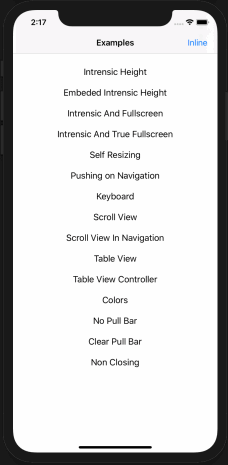
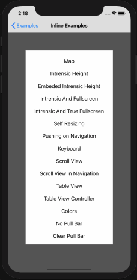

# FittedSheets
Bottom sheets for iOS


Minimum requirement:  
 
 
  

## About
This project is to enable easily presenting view controllers in a bottom sheet that supports scrollviews and multiple sizes. Contributions and feedback are very welcome.  

The bottom sheet tries to be smart about the height it takes. If the view controller is smaller than the sizes specified, it will only grow as large as the intrinsic height of the presented view controller. If it is larger, it will stop at each height specified in the initializer or setSizes function.

| Intrinsic Heights | Fullscreen Modal | True Fullscreen | Scrolling | Inline |
|:-:|:-:|:-:|:-:|:-:|
|  |  |  |  |  |

## Usage

Some options can only be set when setting up the fitted sheets. These are set in the `SheetOptions` property of the constructor.

_The constructor is `init(controller:, sizes:, options:)`. Sizes is optional, but if specified, the first size in the array will determine the initial size of the sheet. Options is also optional, if not specified, the default options will be used._  

**Using default settings**  

```swift
import FittedSheets

let controller = MyViewController()

let sheetController = SheetViewController(controller: controller)

self.present(sheetController, animated: true, completion: nil) 
```

**Customizing settings**  

```swift
let controller = MyViewController()

let options = SheetOptions(
    // The full height of the pull bar. The presented view controller will treat this area as a safearea inset on the top
    pullBarHeight: 24,
    
    // The corner radius of the shrunken presenting view controller
    presentingViewCornerRadius: 20, 
    
    // Extends the background behind the pull bar or not
    shouldExtendBackground: true,
    
    // Attempts to use intrinsic heights on navigation controllers. This does not work well in combination with keyboards without your code handling it.
    setIntrinsicHeightOnNavigationControllers: true, 
    
    // Pulls the view controller behind the safe area top, especially useful when embedding navigation controllers
    useFullScreenMode: true,
    
    // Shrinks the presenting view controller, similar to the native modal
    shrinkPresentingViewController: true,
    
    // Determines if using inline mode or not
    useInlineMode: false,
    
    // Adds a padding on the left and right of the sheet with this amount. Defaults to zero (no padding)
    horizontalPadding: 0,
    
    // Sets the maximum width allowed for the sheet. This defaults to nil and doesn't limit the width.
    maxWidth: nil
)

let sheetController = SheetViewController(
    controller: controller, 
    sizes: [.intrinsic, .percent(0.25), .fixed(200), .fullscreen])
    
    
// The size of the grip in the pull bar
sheetController.gripSize = CGSize(width: 50, height: 6)

// The color of the grip on the pull bar
sheetController.gripColor = UIColor(white: 0.868, alpha: 1)

// The corner curve of the sheet (iOS 13 or later)
sheetController.cornerCurve = .continuous

// The corner radius of the sheet
sheetController.cornerRadius = 20
    
// minimum distance above the pull bar, prevents bar from coming right up to the edge of the screen
sheetController.minimumSpaceAbovePullBar = 0 

// Set the pullbar's background explicitly
sheetController.pullBarBackgroundColor = UIColor.blue

// Determine if the rounding should happen on the pullbar or the presented controller only (should only be true when the pull bar's background color is .clear)
sheetController.treatPullBarAsClear = false

// Disable the dismiss on background tap functionality
sheetController.dismissOnOverlayTap = false

// Disable the ability to pull down to dismiss the modal
sheetController.dismissOnPull = false

/// Allow pulling past the maximum height and bounce back. Defaults to true.
sheetController.allowPullingPastMaxHeight = false

/// Automatically grow/move the sheet to accomidate the keyboard. Defaults to true.
sheetController.autoAdjustToKeyboard = true

// Color of the sheet anywhere the child view controller may not show (or is transparent), such as behind the keyboard currently
sheetController.contentBackgroundColor

// Change the overlay color
sheetController.overlayColor = UIColor.red

self.present(sheetController, animated: false, completion: nil)
```

**Handling dismiss events**
```swift
let sheet = SheetViewController(controller: controller, sizes: [.fixed(420), .fullScreen])
sheet.shouldDismiss = { _ in
// This is called just before the sheet is dismissed. Return false to prevent the build in dismiss events
    return true
}
sheet.didDismiss = { _ in
    // This is called after the sheet is dismissed
}
self.present(sheet, animated: false, completion: nil)
```

**

## Inline presentation  
_Starting with version 2.0.0, the ability to present inline was added. THis allows recreating behaviours like Maps_

```swift
let controller = MyViewController()

let options = SheetOptions(
    useInlineMode: true
)

let sheetController = SheetViewController(controller: controller, sizes: [.percent(0.3), .fullscreen], options: options)
sheetController.allowGestureThroughOverlay = true

// animate in
sheetController.animateIn(to: view, in: self)
```

## Scrolling

```swift
/// This should be called by any child view controller that expects the sheet to use be able to expand/collapse when the scroll view is at the top.
func handleScrollView(_ scrollView: UIScrollView)
```

There is an extension on UIViewController that gives you a `sheetViewController` that attempts to find the current SheetViewController so you can attach like this:

```swift
override func viewDidLoad() {
  super.viewDidLoad()
  
  self.sheetViewController!.handleScrollView(self.scrollView) // or tableView/collectionView/etc
}
```

## Package Management
We support [cocoapods](http://cocoapods.org/), carthage, and SPM.  

**Cocoapods**
Add this to your podfile to add FittedSheets to your project.  

```
pod 'FittedSheets'
```

## License
FittedSheets uses the MIT License:

Please see included [LICENSE file](https://raw.githubusercontent.com/gordontucker/FittedSheets/master/LICENSE).
