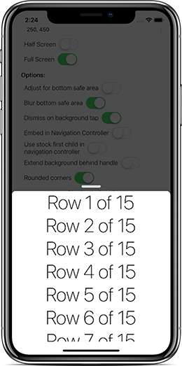
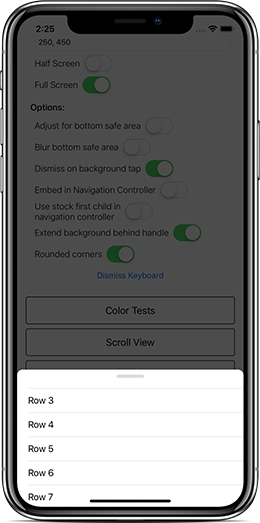

# FittedSheets
Bottom sheets for iOS

Minimum requirement:  
 
 
  

## About
This project is to enable easily presenting view controllers in a bottom sheet that supports scrollviews and multiple sizes. Contributions and feedback are very welcome.  

The bottom sheet tries to be smart about the height it takes. If the view controller is smaller than the sizes specified, it will only grow as large as the intrensic height of the presented view controller. If it is larger, it will stop at each height specified in the initializer or setSizes function.

| Default Settings | Extended Background | Color Tinted | Interactable |
|:-:|:-:|:-:|:-:|
|  |  |  |  |  

## Usage
Using a bottom sheet is simple. 

_The constructor is `init(controller:, sizes:)`. Sizes is optional, but if specified, the first size in the array will determine the initial size of the sheet._  

**Using default settings**  

```swift
let controller = MyViewController()

let sheetController = SheetViewController(controller: controller)

// It is important to set animated to false or it behaves weird currently
self.present(sheetController, animated: false, completion: nil) 
```

**Customizing settings**  

```swift
let controller = MyViewController()

let sheetController = SheetViewController(controller: controller, sizes: [.fixed(100), .fixed(200), .halfScreen, .fullScreen])

// Adjust how the bottom safe area is handled on iPhone X screens
sheetController.blurBottomSafeArea = false
sheetController.adjustForBottomSafeArea = true

// Turn off rounded corners
sheetController.topCornersRadius = 0

// Make corners more round
sheetController.topCornersRadius = 15

// Disable the dismiss on background tap functionality
sheetController.dismissOnBackgroundTap = false

// Extend the background behind the pull bar instead of having it transparent
sheetController.extendBackgroundBehindHandle = true

// Change the overlay color
sheetController.overlayColor = UIColor.red

// Change the handle color
sheetController.handleColor = UIColor.orange

self.present(sheetController, animated: false, completion: nil)
```

**Handling dismiss events**
```swift
let sheet = SheetViewController(controller: controller, sizes: [.fixed(420), .fullScreen])
sheet.willDismiss = { _ in
    // This is called just before the sheet is dismissed
}
sheet.didDismiss = { _ in
    // This is called after the sheet is dismissed
}
self.present(sheet, animated: false, completion: nil)
```

## Settings

```swift
/// This should be called by any child view controller that expects the sheet to use be able to expand/collapse when the scroll view is at the top.
func handleScrollView(_ scrollView: UIScrollView)
```

There is an extension on UIViewController that gives you a `sheetViewController` that attempts to find the current SheetViewController so you can attach like this:

```swift
override func viewDidLoad() {
  super.viewDidLoad()
  
  self.sheetViewController!.handleScrollView(self.scrollView) // or tableView/collectionView/etc
}
```

## Cocoapods
The easiest way to integrate the project is through [cocoapods](http://cocoapods.org/).  
Add this to your podfile to add FittedSheets to your project.  

```
pod 'FittedSheets'
```

## TODO

* Add support for carthage
* Add bounce effect when opening/closing
* Support interacting with the background while the sheet is open

## License
FittedSheets uses the MIT License:

Please see included [LICENSE file](https://raw.githubusercontent.com/gordontucker/FittedSheets/master/LICENSE).
